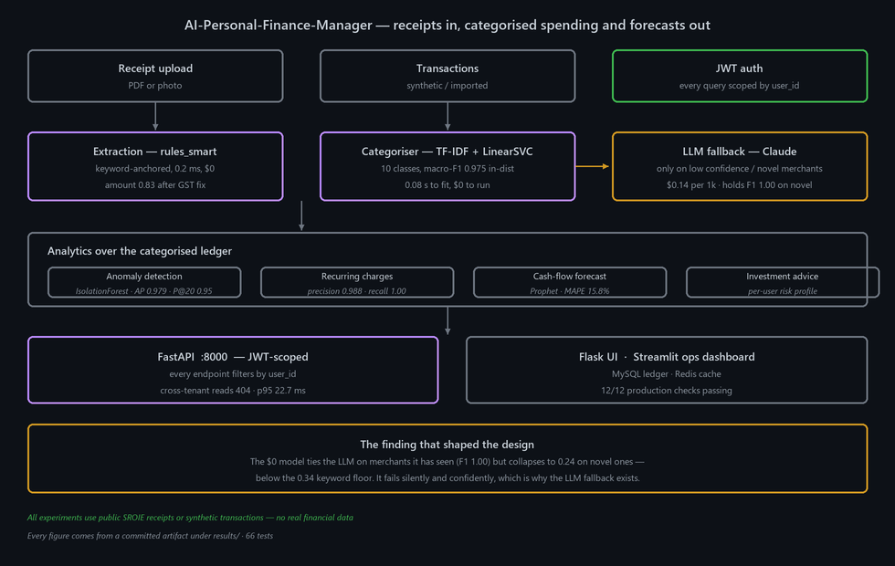

> 🔗 **Live demo:** https://iambatman07-ai-personal-finance-manager.hf.space

# AI-Personal-Finance-Manager

A personal-finance service that reads a receipt, works out what you spent it on, and turns a ledger of transactions into something useful: flagged anomalies, detected recurring charges, a cash-flow forecast, and risk-profiled investment suggestions. It runs as a JWT-scoped FastAPI service behind a Flask UI, with every query filtered by `user_id`.

Each component was benchmarked against the simplest thing that could work **and** against a frontier LLM, so the cost/quality trade-off is measured rather than assumed.

> Data discipline: every experiment uses **public** (SROIE receipts) or **synthetic** transaction data. No real personal financial data is used anywhere.

---

## Architecture



---

## Measured results

### The finding that shaped the design

The categoriser was tested on 100 held-out transactions deliberately split into **60 merchants it had seen** and **40 it never had**:

| Method | macro-F1 | In-distribution | **Novel merchants** | Cost / 1k |
|---|---:|---:|---:|---:|
| keyword (baseline) | 0.6429 | 0.7725 | **0.3408** | $0 |
| TF-IDF + LinearSVC (champion) | 0.6759 | **1.0000** | **0.2418** | $0 |
| Claude Opus 4.8, zero-shot | **1.0000** | 1.0000 | **1.0000** | $0.14 |

**The free model ties the LLM perfectly on merchants it has seen — and then falls *below the keyword floor* on ones it hasn't.** 0.2418 against the keyword scan's 0.3408. It fails silently and confidently on unseen brands.

That is why production keeps an LLM fallback for low-confidence and novel merchants rather than shipping the champion alone. Source: [`results/phase6_frontier.json`](results/phase6_frontier.json)

### Nothing in the feature stack fixes it

| Stage | macro-F1 | In-dist | Novel |
|---|---:|---:|---:|
| S1 keyword baseline | 0.6429 | 0.7725 | 0.3408 |
| S2 + TF-IDF(word) + LinearSVC | **0.7585** | 0.9866 | 0.2673 |
| S3 + char n-grams | 0.6862 | 1.0000 | 0.2945 |
| S4 + Optuna tuning | 0.6759 | 1.0000 | 0.2418 |
| S5 + disambiguation override | 0.6759 | 1.0000 | 0.2418 |

Word+char features and tuning **perfect** the in-distribution fit (1.0000) while making macro-F1 *worse*. Nothing lifts novel-merchant F1 past ~0.29 — that is the out-of-vocabulary ceiling for TF-IDF. Source: [`results/phase6_frontier.json`](results/phase6_frontier.json)

### Receipt extraction

50 fresh SROIE receipts, unseen during development:

| Method | Amount | Date | Merchant | sec/doc | $/1k docs |
|---|---:|---:|---:|---:|---:|
| regex (original) | 0.18 | 0.78 | 0.00 | 0.0002 | $0 |
| **rules_smart (champion)** | **0.80** | 0.80 | 0.48 | 0.0002 | **$0** |
| Claude Opus 4.8 (n=25) | **0.96** | **1.00** | **0.96** | 2.1 | $3.30 |

The rules champion recovers most of the regex's error at zero cost and ~10,000× the speed; the LLM is better still but is kept as a fallback, not the default.

A separate error analysis found the dominant failure was GST two-column totals — patching it lifted amount accuracy **0.58 → 0.83** on the development set, fixing 26 receipts. Source: [`results/phase6_frontier.json`](results/phase6_frontier.json) · [`results/phase4_extraction.json`](results/phase4_extraction.json)

### Categoriser, in-distribution

180-transaction test split, 10 classes:

| Method | macro-F1 | Accuracy | Fit + predict |
|---|---:|---:|---:|
| keyword (baseline) | 0.6580 | 0.6056 | 0 s |
| TF-IDF + LightGBM | 0.8501 | 0.8611 | 3.7 s |
| **TF-IDF + LinearSVC (champion)** | **0.9752** | 0.9778 | **0.08 s** |
| SBERT + LightGBM | 0.9388 | 0.9389 | 18.7 s |
| DistilBERT fine-tune (ceiling) | 0.9943 | 0.9944 | 71.7 s |

The champion reaches **98% of DistilBERT's F1 in 1/900th of the fit time**. Source: [`results/phase2b_categorize.csv`](results/phase2b_categorize.csv)

### Analytics

| Component | Result | Source |
|---|---|---|
| Anomaly detection | IsolationForest **AP 0.979**, P@20 0.95 — vs robust z-score AP 0.400 and STL residual AP 0.256 | [`phase2c_anomaly_forecast.csv`](results/phase2c_anomaly_forecast.csv) |
| Recurring charges | precision **0.988**, recall **1.000** | same |
| Duplicate detection | precision 0.400, recall 0.667 — **the weakest component** | same |
| Cash-flow forecast | Prophet MAPE **15.8%**, beating seasonal-naive 18.9% and naive 26.3% | same |
| Active learning | hard-case accuracy **0.521 → 0.887** in 6 rounds, vs 0.606 for random sampling | [`phase5_active_learning.csv`](results/phase5_active_learning.csv) |
| OCR robustness | amount accuracy degrades 0.72 (gold text) → 0.58 (phone photo) → 0.33 (faded) | [`phase5_ocr.csv`](results/phase5_ocr.csv) |
| Production checks | **12/12 passing**, p95 latency 22.7 ms | [`phase7_production.json`](results/phase7_production.json) |

---

## How it works

1. **Authenticate** — JWT; every downstream query is scoped by `user_id`, and cross-tenant reads 404 rather than leaking existence.
2. **Extract** — `rules_smart` anchors on keywords to find the total, date and merchant, with GST two-column handling.
3. **Categorise** — TF-IDF (word + char) into a LinearSVC over 10 classes. Low-confidence or novel-merchant rows fall through to the LLM.
4. **Detect** — IsolationForest for anomalies, grouping for recurring charges, and a duplicate-charge check.
5. **Forecast** — Prophet over monthly outflows.
6. **Recommend** — per-user risk profile drives investment suggestions.
7. **Serve** — FastAPI with Redis caching; the Flask UI and Streamlit ops dashboard call the service.

## Infrastructure

| Layer | Technology |
|---|---|
| Extraction | pdfplumber + rule engine · LLM fallback (Claude) |
| Categorisation | scikit-learn TF-IDF + LinearSVC · Optuna |
| Anomaly / forecast | IsolationForest · Prophet |
| API | FastAPI, JWT-scoped |
| UI | Flask · Streamlit ops dashboard |
| Store | MySQL · Redis |
| Packaging | Docker Compose |
| Tests | 66 |

---

## Quickstart

```bash
python -m venv .venv && .venv/Scripts/activate      # (Windows) or source .venv/bin/activate
pip install -r requirements-api.txt                 # API/service stack
python -m src.categorization.train                  # build models/expense_classifier.joblib

uvicorn api:app --port 8000                          # ML API  → http://localhost:8000/docs
docker compose up                                    # FastAPI + Redis
```

Research stack — the experiment scripts under `results/`:

```bash
pip install -r requirements-experiments.txt
python results/run_day2_extraction.py               # extraction bake-off
python results/run_day3_categorize.py               # categorizer bake-off
python results/run_day4_anomaly_forecast.py         # anomaly + forecast
```

Tests: `pytest tests/ -q`. Regenerate the diagram: `python assets/make_architecture.py`.

---

## License

MIT — see [LICENSE](LICENSE).
